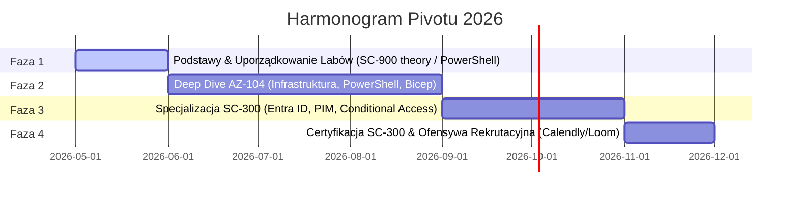

# Strategia Rozwoju Zawodowego i Budowania Wiarygodności Eksperckiej (2026)
## Kierunek: Cloud Security & Identity and Access Management (IAM)

W roku 2026 sektor Identity & Access Management (IAM) przestał być jedynie nudną funkcją administracyjną, stając się "kręgosłupem" bezpieczeństwa w architekturze Zero Trust. W dobie wszechobecnych agentów AI i rozproszonej infrastruktury chmurowej, tożsamość jest nowym perymetrem. 

Niniejszy plan pozycjonuje Cię w elicie finansowej rynku technologicznego, łącząc wojskową dyscyplinę (17 lat w Marynarce Wojennej), precyzję AML oraz nowoczesny warsztat inżynieryjny w chmurze Microsoft Azure.

---

## 1. Analiza Strategiczna Rynku Pracy: Dlaczego IAM i Cloud?

Rynek cyberbezpieczeństwa uległ drastycznej polaryzacji. Podczas gdy tradycyjne role, takie jak SOC Analyst, przeżywają oblężenie (średnio 400 aplikantów na jedno miejsce) i zmagają się z automatyzacją AI, sektor IAM pozostaje wysoce opłacalną i mniej zatłoczoną niszą.

### Dynamika stawek i "Crypto Premium"
* **Sektor Crypto / High-Risk**: Błędy w konfiguracji IAM mają tam charakter egzystencjalny ("Password = Money"). Brak FDIC czy chargebacków sprawia, że inżynierowie IAM zarządzający kluczami (Vault Keys) zarabiają w tej niszy nawet do **250 000 USD rocznie**.
* **Sektor Korporacyjny / Enterprise**: Stabilne stawki kontraktowe dla inżynierów IAM zaczynają się od **100 USD/h wzwyż**.

> [!NOTE]
> Twoja siła negocjacyjna wynika z "cichej desperacji" rekruterów poszukujących wykwalifikowanych specjalistów. Gdy 390 z 400 kandydatów do SOC odpada w przedbiegach, Ty wchodzisz na rynek IAM, gdzie Twoje umiejętności zarządzania dostępem uprzywilejowanym (PAM) i ładem tożsamości (IGA) są towarem deficytowym.

---

## 2. Pivot z AML i Wojska do IAM: Twoja Asymetryczna Przewaga

Twoja transformacja to nie jest "zmiana branży od zera" — to naturalna ewolucja profilu zawodowego. Rynek w 2026 roku cierpi na głęboki kryzys zaufania (Trust Recession) spowodowany masowym generowaniem CV przez AI. Połączenie Twoich doświadczeń stanowi unikalny wyróżnik:

```
[17 lat w Marynarce Wojennej] + [Doświadczenie AML] 
                      │
                      ▼
    [Wojskowy Rygor & Zrozumienie Ryzyka] 
                      │
                      ▼
         [Ekspert SecOps / IAM / PAM]
```

### Kluczowe wyróżniki:
1. **Military Background (Navy Veteran)**: Wojskowy rygor to fundament SecOps. Posiadanie **Poświadczenia Bezpieczeństwa (Clearance Status)** to natychmiastowa przepustka do sektorów o podwyższonym rygorze (bankowość, rząd, defense).
2. **AML Compliance**: Mapowanie procedur przeciwdziałania przestępczości finansowej na techniczne mechanizmy kontroli dostępu:

| Koncepcja AML | Odpowiednik w IAM / Cloud Security | Cel Techniczny i Biznesowy |
| :--- | :--- | :--- |
| **KYC** (Know Your Customer) | **Identity Verification** | Uwierzytelnianie i weryfikacja tożsamości cyfrowej. |
| **Monitoring transakcji** | **Audit Logs / Governance** | Śledzenie aktywności kont, logowań i wykrywanie anomalii. |
| **Sanctions Screening** | **Conditional Access / Identity Protection** | Risk-based Access – blokowanie dostępu na bazie ryzyka. |
| **Compliance Audits** | **Access Reviews / IGA** | Cykliczna weryfikacja uprawnień (kto ma do czego dostęp). |
| **Onboarding Klienta** | **JML** (Joiner, Mover, Leaver) | Zarządzanie cyklem życia tożsamości (Identity Lifecycle). |

---

## 3. Model Trzech Ścieżek: Edukacja, Certyfikacja, Projekty

W obliczu recesji zaufania do samych dyplomów, Twoja strategia opiera się na twardych danych i automatyzacji.

### Strategiczna Hierarchia Certyfikacji (Cel: SC-300 w listopadzie 2026)
1. **Podstawy**: Opanowane materiały **ISC² CC** oraz **SC-900** stanowią doskonałą bazę pojęciową i teoretyczną (zabezpieczanie tożsamości, podstawy kryptografii, model Zero Trust). Zwalnia Cię to z konieczności zdawania teoretycznego certyfikatu Security+.
2. **Infrastruktura**: **AZ-104 (Microsoft Azure Administrator)** – priorytet. IAM w chmurze nie istnieje bez zrozumienia sieci (Networking) i maszyn wirtualnych (Compute).
3. **Specjalizacja (Główny Cel)**: **SC-300 (Microsoft Identity and Access Administrator)** – potwierdzenie biegłości w Microsoft Entra ID.
4. **Nisze (Premium w przyszłości)**: Okta Certified Professional, SailPoint (IGA) lub CyberArk (PAM).

### Narzędzia i Automatyzacja
Statystyki (np. Josh Madakor) pokazują przewagę **PowerShell (34%)** nad Pythonem (28%) w rolach IAM. Zgodnie z zasadami projektu, **PowerShell oraz Azure CLI stanowią główne narzędzia automatyzacji**.

---

## 4. Laboratorium Kompetencji: Portfolio „Proof of Work”

Aby pokonać nieufność rekruterów, musisz dostarczyć projekty rozwiązujące realne problemy biznesowe (Business Impact).

### 5 Kluczowych Projektów w Portfolio:
1. **Dashboard Widoczności Kosztów**: Implementacja Azure Monitor + Logic Apps + Terraform (itygacja niekontrolowanego spendu).
2. **Automatyzacja Backupów w Chmurze**: Skrypty PowerShell / Azure CLI zapewniające ciągłość działania (BCP).
3. **System Monitoringu i Alertowania**: Wdrożenie pełnego stosu monitoringu dostępności usług (Alerting).
4. **IAM Governance as Code**: Automatyzacja wdrażania ról RBAC i polityk Conditional Access w Entra ID za pomocą IaC (ARM templates/Bicep).
5. **Hardening Obrazów OS na Azure**: CIS Framework, Packer, GitHub Actions do tworzenia tzw. Golden Images.

> [!TIP]
> **Multimodalne dokumentowanie projektów**:
> * **Kod na GitHub**: Czyste repozytoria IaC z profesjonalnymi plikami README.
> * **Loom Video Demo**: Krótkie (5-10 min) nagranie wideo prezentujące kod, architekturę i Twój sposób myślenia. To ostateczny dowód na to, że kod nie został bezmyślnie skopiowany z AI.
> * **Calendly CTA**: Bezpośredni link do Twojego kalendarza w README projektu, umożliwiający rekruterowi technicznemu natychmiastowe zabukowanie rozmowy z pominięciem sita HR.

---

## 5. Strategia Outreachu i Zarządzanie Lejkiem

* **Odświeżanie Profilu**: Codzienne wgrywanie nowej kopii CV na platformy rekrutacyjne rano, co pozycjonuje profil na szczycie wyników wyszukiwania algorytmów rekruterów.
* **Strategia „Rejection Loom”**: Po otrzymaniu odmowy lub oferty niespełniającej kryteriów, wyślij krótkie nagranie wideo: *"Dziękuję za czas. Ten projekt nie jest dopasowany do mnie na teraz, ale załączam krótkie demo mojego labu zabezpieczania tożsamości — może przyda się przy innych wyzwaniach w przyszłości"*. To buduje cenną sieć kontaktów.
* **4 Posty na Projekt (LinkedIn)**: Jeden projekt techniczny to paliwo na serię postów (Wideo Loom $\to$ Deep dive w kod $\to$ Diagram architektury $\to$ Analiza post-mortem).

---

## 6. Harmonogram Egzekucji „Baby-Friendly” (Micro-Learning)

Jako nowy tata i inżynier w procesie pivotu, musisz stosować **Micro-Learning** — krótkie sesje (15-30 minut) zorientowane na realizację konkretnego celu, zamiast długich maratonów.



### Fazy Działania:
* **Miesiąc 1**: Konsolidacja repozytorium `IAM_labs`, zmapowanie AML $\to$ IAM w Study Journal, opanowanie podstaw PowerShell.
* **Miesiące 2-4 (AZ-104)**: Skupienie na Networking i Compute. Pierwsze laby IaC oraz automatyzacji procesów.
* **Miesiące 5-6 (SC-300)**: Budowanie zaawansowanych labów w Entra ID (PIM, Conditional Access), publiczna dokumentacja i diagramy.
* **Listopad 2026**: Egzamin SC-300. Pełna ofensywa na LinkedIn z wykorzystaniem statusu "Cleared Veteran".

---

> [!IMPORTANT]
> **Zasada Kumulacji Commitów (zgodnie z RULE[GEMINI.md])**:
> Aby utrzymać czystą historię repozytorium, zmiany w dokumentacji i kodzie synchronizujemy zbiorczo na koniec sesji roboczej lub na wyraźne polecenie ("wypchnij"). Unikamy cząstkowych `git push` po drobnych edycjach.
