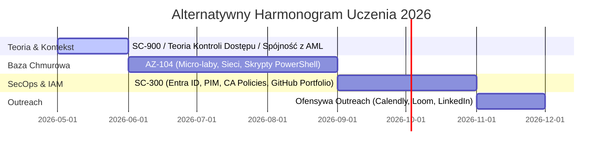

# Alternatywne Spojrzenie: Strategia Wojskowego Wyróżnika w Rekrutacji Security (2026)

Niniejszy dokument przedstawia alternatywny, oparty na psychologii rynku i asymetrii kompetencji plan przejścia do sektora **Identity & Access Management (IAM)**. Stanowi on odmienną perspektywę (Alternative Blueprint) wobec standardowej ścieżki certyfikacyjno-technologicznej.

---

## 1. Założenie Główne: "Trust Recession" na Rynku Pracy 2026

Rynek IT Security w 2026 roku uległ drastycznej zmianie z powodu masowego wykorzystania generatywnej sztucznej inteligencji. Rekruterzy są zalewani idealnymi profilami CV i kodem, którego autorzy często nie rozumieją.

**Główna Teza**: Na rynku brakuje ludzi, których tożsamość i wiarygodność można szybko zweryfikować. Twoja ścieżka opiera się na **trzech niekopiowalnych przez AI elementach**:

```
                 ┌──────────────────────────────────────┐
                 │    17 lat w Marynarce Wojennej       │ ──► Dyscyplina SecOps & procedury
                 └──────────────────┬───────────────────┘
                                    ▼
                 ┌──────────────────────────────────────┐
                 │  Poświadczenie Bezpieczeństwa (Sec)  │ ──► Gotowość do projektów krytycznych
                 └──────────────────┬───────────────────┘
                                    ▼
                 ┌──────────────────────────────────────┐
                 │     Doświadczenie w regulowanym AML  │ ──► Zrozumienie ryzyka biznesowego
                 └──────────────────────────────────────┘
```

---

## 2. Strategiczne Odwrócenie Vettingu (Bypass HR)

W tradycyjnej rekrutacji Twoje CV musiałoby konkurować z setkami innych. Nasza alternatywna strategia zakłada bezpośrednie uderzanie do osób decyzyjnych (Hiring Managers) przy użyciu techniki **multimodalnej weryfikacji kompetencji**:

### Narzędzia Asymetrycznej Przewagi:
* **Loom Knowledge Transfer**: Nagranie 5-10 minutowego wideo z omówieniem architektury Twoich laboratoriów. Rekruter widzi Twoją twarz, słyszy Twój głos i widzi, jak tłumaczysz kod. AI nie potrafi tego sfałszować w naturalny sposób na żywo.
* **Link Calendly w README**: Umieszczenie zaproszenia do bezpośredniego kontaktu w repozytorium GitHub pozwala menedżerowi technicznemu pominąć etap HR i przejść od razu do rozmowy o architekturze.
* **Strategia "Rejection Loom"**: Gdy zostaniesz odrzucony ze względu na brak doświadczenia komercyjnego, wysyłasz wideo z podziękowaniem i prezentacją Twojego labu. To buduje sieć kontaktów i często skutkuje poleceniem do innych projektów.

---

## 3. Przełożenie Doświadczenia Wojskowego na SecOps

Służba w Marynarce Wojennej uczy dwóch rzeczy kluczowych w bezpieczeństwie IT:
1. **Dyscyplina Operacyjna (SOP)**: W IAM każdy krok musi być zgodny z procedurą. Twoje doświadczenie z procedurami wojskowymi czyni Cię idealnym kandydatem do wdrażania ról typu **Privileged Identity Management (PIM)**, gdzie rygor dostępu czasowego jest kluczowy.
2. **Zarządzanie Incydentami pod Presją**: Reagowanie na naruszenia bezpieczeństwa w chmurze wymaga zimnej krwi i postępowania według playbooka.

---

## 4. Harmonogram Działań „Baby-Friendly” (Micro-Learning)

Jako młody tata nie dysponujesz wielogodzinnymi blokami wolnego czasu. Alternatywna nauka zakłada przejście na model **Micro-Learning** (szczegółowy harmonogram poniżej):



* **Złota Zasada**: Codzienne 30 minut z PowerShell/Azure CLI przynosi lepsze rezultaty w budowaniu pamięci mięśniowej niż weekendowy maraton, a jednocześnie pozwala na zachowanie balansu życiowego.
